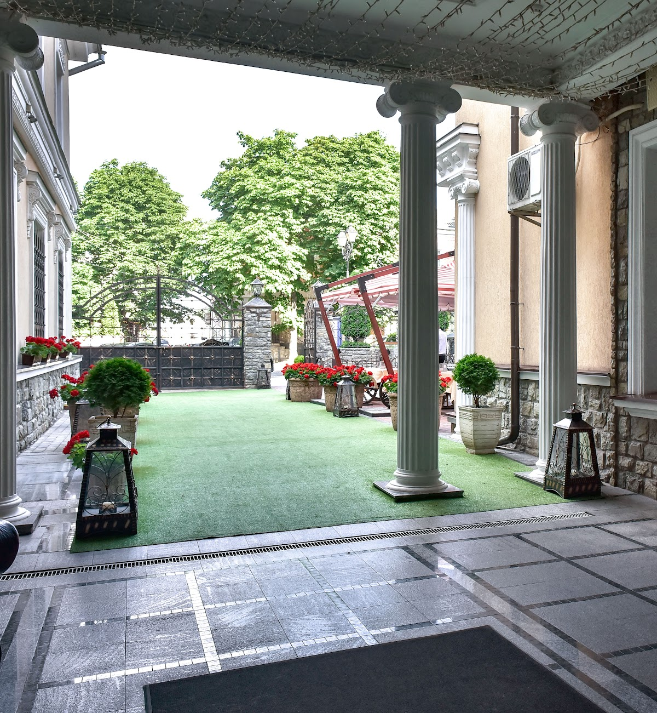

<div align="center">



<br><br>

# ✦ Готель Клеопатра ✦
### Офіційний сайт · Кам'янець-Подільський

[](https://github.com/IT-Kamianets/kleopatra.itkamianets.com/actions/workflows/deploye.yml)
[](https://angular.dev)
[](https://tailwindcss.com)
[](https://www.typescriptlang.org)
[](https://kleopatra.itkamianets.com)
[](LICENSE)

**[🌐 kleopatra.itkamianets.com](https://kleopatra.itkamianets.com)**

</div>

---

## ✦ Про проєкт

Офіційний сайт готелю **«Клеопатра»** — чотиризіркового готельного комплексу у самому серці Старого міста Кам'янця-Подільського. Сайт побудований як Single Page Application із темним luxury-дизайном, glassmorphism-ефектами, плавними анімаціями та повною підтримкою трьох мов.

> **Адреса:** вул. Татарська, 19, Кам'янець-Подільський, 32300
> **Телефон:** +38(03849)9-16-52 · +38(067)380-54-04
> **Email:** kleopatrakp19@gmail.com

---

## ✦ Сторінки сайту

| Сторінка | Маршрут | Опис |
|----------|---------|------|
| Головна | `/` | Hero-слайдер, секція «Про готель», bento-сервіси, форма бронювання |
| Номери | `/numbers` | 82 номери з фільтрацією: Стандарт від 1 700 грн → VIP від 5 000 грн |
| Деталі номера | `/numbers/:type` | Детальна сторінка кожного типу номера |
| Меню | `/menu` | Меню ресторану з фільтрацією по категоріях і цінами |
| Ресторан | `/restaurants` | «За Тином» — зали, бронювання столика |
| Дозвілля | `/leisure` | Басейн, боулінг (6 доріжок), більярд, SPA, хамам, диско-бочка |
| Бізнес | `/biznes` | Конференц-зал 160 місць, зал презентацій, офіс-центр |
| Туризм | `/turizm` | 7 чудес Кам'янця, карта пам'яток, екскурсійні програми |
| Галерея | `/gallery` | Masonry-сітка з lightbox та фільтрацією по категоріях |
| Контакти | `/contacts` | Reactive-форма, Google Maps, всі контактні дані |

---

## ✦ Технічний стек

```
Frontend:   Angular 21 (standalone components, signals, control flow)
Styling:    Tailwind CSS 4.2 (конфіг через @theme в CSS)
            SCSS (кастомні компоненти)
i18n:       Власний TranslationService — UA / EN / PL
Build:      Angular CLI + PostCSS (@tailwindcss/postcss)
Deploy:     GitHub Actions → GitHub Pages
Domain:     kleopatra.itkamianets.com (CNAME)
```

### Ключові технічні рішення
- **Standalone components** — без NgModule, tree-shakeable
- **Angular Signals** — реактивний стан (слайдер, меню, фільтри, мова)
- **`@if` / `@for`** — новий control flow синтаксис Angular 17+
- **Lazy loading** — кожна сторінка окремий chunk
- **TranslationService + TranslatePipe** — кастомна i18n без зовнішніх бібліотек (UA/EN/PL)
- **IntersectionObserver** — scroll-анімації `.opacity-0-init → .animate-in`
- **HostListener** — keyboard-навігація в lightbox галереї
- **Sticky filter scroll** — розумний scroll до фільтра при зміні категорії

---

## ✦ Дизайн-система

| Токен | Значення | Використання |
|-------|---------|--------------|
| `--gold` | `#d3af67` | Акценти, кнопки, заголовки |
| `--gold-light` | `#e8c97c` | Hover-стани |
| `--gold-dark` | `#b8923d` | Градієнти |
| `--wine` | `#531e10` | Фонові акценти hero |
| `--dark-bg` | `#0a0a0a` | Основний фон |
| `--dark-card` | `#111111` | Картки |

**Шрифти:** Cormorant Garamond (display) · Inter (body)
**Класи:** `.btn-gold` · `.btn-outline-gold` · `.glass-card` · `.gradient-text`

---

## ✦ Структура проєкту

```
src/
├── app/
│   ├── core/
│   │   ├── header/          # Glassmorphic navbar (scroll + mobile menu + language switcher)
│   │   ├── footer/          # Dark luxury footer з соц. мережами та GitHub
│   │   └── translation/     # TranslationService (UA/EN/PL)
│   ├── i18n/
│   │   ├── uk.ts            # Українські переклади
│   │   ├── en.ts            # English translations
│   │   ├── pl.ts            # Polskie tłumaczenia
│   │   └── translations.type.ts
│   ├── shared/
│   │   ├── translate.pipe.ts        # | translate pipe
│   │   └── scroll-animate.directive.ts
│   └── pages/
│       ├── home/            # Hero slider + bento grid + booking form
│       ├── numbers/         # Room cards + filter tabs
│       ├── room-detail/     # Детальна сторінка номера
│       ├── menu/            # Меню ресторану + filter tabs
│       ├── restaurants/     # Зали + бронювання
│       ├── leisure/         # SPA сервіси + slider
│       ├── biznes/          # Conference room specs
│       ├── turizm/          # Attractions + tours + map
│       ├── gallery/         # Masonry + lightbox
│       └── contacts/        # ReactiveFormsModule + Maps
├── tailwind.css             # Tailwind v4 (@import + @theme + @source)
└── styles.scss              # Global luxury styles
```

---

## ✦ Локальний запуск

```bash
# Клонувати репозиторій
git clone https://github.com/IT-Kamianets/kleopatra.itkamianets.com.git
cd kleopatra.itkamianets.com

# Встановити залежності
npm install

# Dev-сервер на :4200
ng serve

# Production build
ng build --configuration production
```

---

## ✦ Деплой

Деплой відбувається **автоматично** при кожному push у гілку `master`:

```
master push → GitHub Actions → ng build --production → GitHub Pages
```

Workflow: [`.github/workflows/deploye.yml`](.github/workflows/deploye.yml)

**Налаштування GitHub Pages:**
`Settings → Pages → Source → GitHub Actions`

---

## ✦ Готель Клеопатра

| | |
|--|--|
| **Зірки** | ★★★★ (4 зірки) |
| **Номерів** | 82 (Стандарт · Люкс · Бізнес · VIP) |
| **Ресторан** | «За Тином» — великі зали, тераси, банкети |
| **Дозвілля** | Басейн · Боулінг 6 доріжок · Більярд · SPA · Хамам |
| **Бізнес** | Конференц-зал 160 місць · Зал презентацій · Офіс-центр |
| **Рецепція** | 24/7 |
| **Локація** | Старе місто, 500 м від фортеці |

---

<div align="center">

**[🌐 Відкрити сайт](https://kleopatra.itkamianets.com)** · **[📞 +38(03849)9-16-52](tel:+380384991652)** · **[📘 Facebook](https://www.facebook.com/kleopatra.hotel.kp)**

<sub>© 2026 Готель Клеопатра · Кам'янець-Подільський · Designed by <a href="https://github.com/andre20122002">Danylchuk Andriy</a></sub>

</div>
